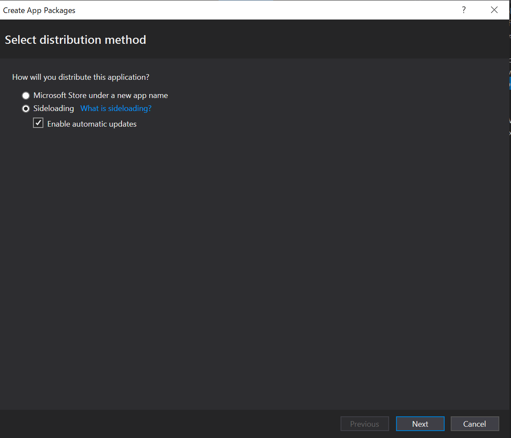

## WPF .NET Core アプリのインストーラーを作成する。

### 1. パッケージ用のプロジェクトを追加

- 新しいプロジェクトを追加
  テンプレートの名前は `Windows Application Packaging Project`。C# 用と VB 用があるので間違えないようにします。

- インストーラーを作成したい WPF アプリを参照に追加

### 2. アプリを署名

- パッケージ用のプロジェクトに作成された `.appmanifest` ファイルをダブルクリック
- Packaging タブを選択、Choose Certificate ボタンをクリック

  

- `Create Certificate` ボタンを選択して、自己署名の証明書を作成。(下記のスクリーンショットは作成して設定済み)。
  

下記手順により、署名用の `pfx` ファイルが作成されてプロジェクトに追加されます。

> TODO: pfxファイルの説明入れたい

### 3. 公開

- パッケージング用のプロジェクトを右クリックして、 `Publish` > `Create App Package` を選択

- Distribution Method は `Sideloding` にします。これは、Microsoft Store 以外からアプリを配布したいケースで選択します。

  

> TODO: `Sideloding` の設定で何が変わるの？

